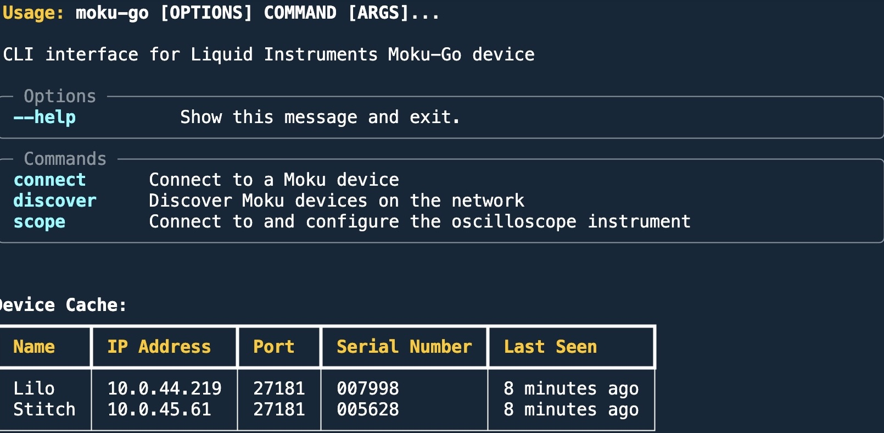

# [Moku-Go](https://github.com/sealablab/Moku-Go)


[](https://opensource.org/licenses/MIT)
[](https://www.python.org/downloads/)
[](https://github.com/sealablab/Moku-Go)
[](https://github.com/sealablab/Moku-Go)
> The CLI you always wanted 🚀
[](https://asciinema.org/a/ktQVg6EboUtowrreHyv1I8SeL)
```bash
$ moku-go
╭─ Options ──────────────────────────────────────────────────────────────────────────╮
│ --help          Show this message and exit.                                        │
╰────────────────────────────────────────────────────────────────────────────────────╯
╭─ Commands ─────────────────────────────────────────────────────────────────────────╮
│ connect      Connect to a Moku device                                              │
│ discover     Discover Moku devices on the network                                  │
│ scope        Connect to and configure the oscilloscope instrument                  │
│ emfi_seq     Deploy and configure EMFI-Seq bitstream                               │
╰────────────────────────────────────────────────────────────────────────────────────╯
```

## 📋 Table of Contents
- [CLI Interface](#cli-interface)
- [Usage](#usage)
- [Installation](#installation)
- [Environment Variables](#environment-variables)
- [Setting up Moku Bitstreams](#setting-up-moku-bitstreams)
- [EMFI-Seq Module](#emfi-seq)
  - [Configuration File](#configuration-file)
- [Debugging](#debugging)


## 🚀 Usage

### 🔍 Discover Devices
```bash
moku-go discover
```
This will find all Moku devices on your network and cache their information for future use.

### 🔌 Connect to a Device
You can connect using either the device's IP address or its name:
```bash
# Using IP address
moku-go connect 10.0.44.219

# Using device name
moku-go connect Lilo
```

### 📊 Scope
You can use either IP address or device name:
```bash
# Using IP address
moku-go scope 10.0.44.219

# Using device name
moku-go scope Lilo
```

#### Advanced Options
```bash
# With configuration file
moku-go scope 10.0.44.219 --config moku_go/config/scope_config.yaml

# Force connection if device is in use
moku-go scope 10.0.44.219 --force
```

### 🔌 EMFI-Seq
Deploy and configure the EMFI-Seq bitstream:
```bash
# Basic deployment
moku-go emfi_seq 10.0.44.219 path/to/emfi_seq.bit

# With configuration file
moku-go emfi_seq 10.0.44.219 path/to/emfi_seq.bit --config moku_go/config/emfi_seq_config.yaml

# Enable sequencer immediately
moku-go emfi_seq 10.0.44.219 path/to/emfi_seq.bit --enable

# Set custom voltage levels
moku-go emfi_seq 10.0.44.219 path/to/emfi_seq.bit --s1 1.1 --s2 1.2 --s3 1.3 --s4 1.4

# Set custom delays
moku-go emfi_seq 10.0.44.219 path/to/emfi_seq.bit --d1 10 --d2 20 --d3 30 --d4 40
```

### 💾 Device Name Resolution
The CLI maintains a cache of discovered devices in `~/.moku-go/device_cache.json`. This allows you to:
- Use device names instead of IP addresses in commands
- Avoid running discovery every time you want to connect

If the cache becomes invalid, you'll be prompted to run `moku-go discover` again.

## 💻 Installation
We use [uv](https://docs.astral.sh/uv/) for project management:
```bash
git clone git@github.com:sealablab/Moku-Go.git
cd Moku-Go
uv sync
```

## 🏃‍♂️ Running
```bash
uv run hello.py
uv run osc.py
```

## ⚙️ Environment Variables

### Official Moku Environment Variables

| Variable | Description | Example |
|----------|-------------|---------|
| `MOKU_IP` | IP address of your Moku device | `export MOKU_IP=10.0.44.219` |
| `MOKU_DATA_PATH` | Path to Moku bitstreams directory | `export MOKU_DATA_PATH=./mokudatadir` |

### Custom Environment Variables

| Variable | Description | Default | Example |
|----------|-------------|---------|---------|
| `MOKU_FORCE_CONNECT` | Force connection if device is in use | true | `export MOKU_FORCE_CONNECT=true` |
| `MOKU_IGNORE_BUSY` | Ignore device busy state | true | `export MOKU_IGNORE_BUSY=true` |
| `MOKU_PERSIST_STATE` | Maintain device state between connections | true | `export MOKU_PERSIST_STATE=true` |
| `MOKU_CONNECT_TIMEOUT` | Connection timeout in seconds | 10 | `export MOKU_CONNECT_TIMEOUT=10` |
| `MOKU_READ_TIMEOUT` | Read timeout in seconds | 10 | `export MOKU_READ_TIMEOUT=10` |

## 📦 Setting up Moku Bitstreams

1. Create a directory for the bitstreams:
   ```bash
   mkdir ./mokudatadir
   ```

2. Move the bitstream archive into the directory:
   ```bash
   mv mokudata-601.tar ./mokudatadir/
   ```

3. Set the environment variable to point to this directory:
   ```bash
   export MOKU_DATA_PATH=./mokudatadir
   ```

## 🔌 EMFI-Seq Module

The EMFI-Seq module provides functionality for deploying and controlling the EMFI-Seq bitstream on Moku:Go devices.

### Control Register Map
- **Control0[31]**: Enable (inverted: 1=disabled, 0=enabled)
- **Control0[30]**: Clock enable (inverted: 1=frozen, 0=running)
- **Control0[7:0]**: Clock divider select (0=÷1, 1=÷2, ..., 255=÷256)
- **Control1[6:0]**: State 1 delay (7-bit)
- **Control2[6:0]**: State 2 delay (7-bit)
- **Control3[6:0]**: State 3 delay (7-bit)
- **Control4[6:0]**: State 4 delay (7-bit)
- **Control5[15:0]**: State 1 DAC level (signed 16-bit, -5V to +5V)
- **Control6[15:0]**: State 2 DAC level (signed 16-bit, -5V to +5V)
- **Control7[15:0]**: State 3 DAC level (signed 16-bit, -5V to +5V)
- **Control8[15:0]**: State 4 DAC level (signed 16-bit, -5V to +5V)

### Output Map
- **OutputA[15:0]**: DAC stair-step output (signed 16-bit)
- **OutputB[6:0]**: FSM sticky status (bits 0-3: S1-S4 entry markers)
- **OutputC[3:0]**: Current state (one-hot)
- **OutputC[15:4]**: Monitor value MSBs
- **OutputD[7:0]**: Clock divider counter status

### Configuration File 📄
You can use a YAML configuration file to set up the EMFI-Seq module:
```yaml
# Moku-Go EMFI-Seq Configuration

# State delays (cycles, 0-127)
delays:
  state1: 10  # State 1 delay
  state2: 20  # State 2 delay
  state3: 30  # State 3 delay
  state4: 40  # State 4 delay

# Stair-step voltage levels (-5.0V to +5.0V)
voltages:
  state1: 1.1  # State 1 voltage
  state2: 1.2  # State 2 voltage
  state3: 1.3  # State 3 voltage
  state4: 1.4  # State 4 voltage

# Clock configuration
clock:
  divider: 0  # Clock divider (0=÷1, 1=÷2, ..., 255=÷256)
  
# Sequencer state
sequencer:
  enabled: false  # Set to true to enable sequencer on startup
```

#### Using the Configuration File

To use a configuration file with the EMFI-Seq module:

```bash
# Apply a saved configuration
moku-go emfi-seq 192.168.1.100 emfi_seq.bit --config moku_go/config/emfi_seq_config.yaml

# Override specific settings from the command line
moku-go emfi-seq 192.168.1.100 emfi_seq.bit --config moku_go/config/emfi_seq_config.yaml --enable --s1 2.0
```

Command-line options take precedence over the configuration file, so you can override specific values while still using the configuration file for the rest.

#### Creating Custom Configurations

You can create multiple configuration files for different experimental setups:

```bash
# Create a directory for your configurations
mkdir -p ~/moku-configs

# Create different configuration files for different experiments
cp moku_go/config/emfi_seq_config.yaml ~/moku-configs/high_voltage.yaml
cp moku_go/config/emfi_seq_config.yaml ~/moku-configs/low_voltage.yaml
cp moku_go/config/emfi_seq_config.yaml ~/moku-configs/fast_sequence.yaml

# Edit them for your specific needs and use them with the --config option
moku-go emfi-seq 192.168.1.100 emfi_seq.bit --config ~/moku-configs/high_voltage.yaml
```

## 🐛 Debugging

### Common Error
If you see this error:
```python
File "osc.py"
data = i.get_data()
AttributeError: 'NoneType' object has no attribute 'get_data'
```

**Solution**: Moku-Go was unable to locate your upstream bitstreams.
Check your `MOKU_DATA_PATH` Env var, and try again.
